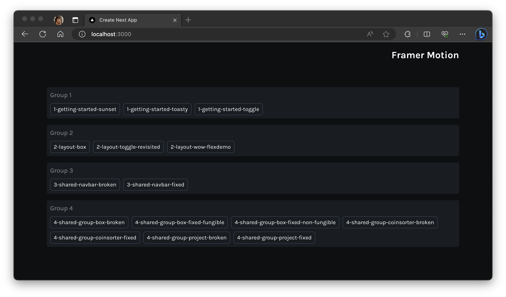
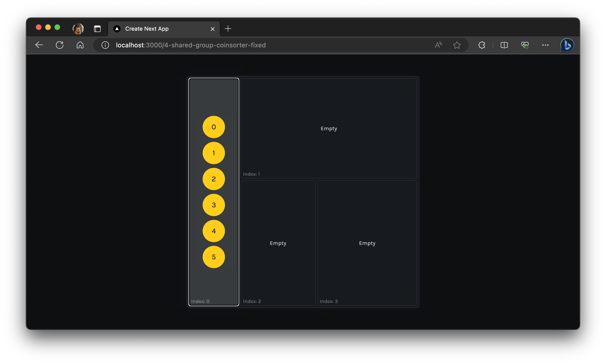
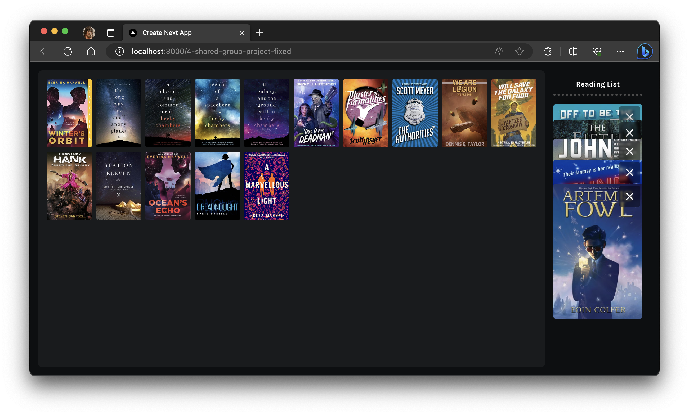

# Framer Motion Overview

> Next.js SSR compatible, Layout Animation, and Shared Layout Features

Welcome to this deep dive into Framer Motion, where we explore the advantages and intricacies of animating React applications with this powerful library.

### Framer Motion Overview

**What are the advantages?**  
Framer Motion offers a simple yet powerful API for creating animations in React applications. Its main benefits include smooth animations, a declarative approach, and compatibility with various frameworks.

**Next.js SSR compatible**  
Framer Motion is fully compatible with Next.js and its server-side rendering (SSR) capabilities. This ensures that animations are seamless and the user experience remains consistent when using both tools together.

**Getting Started with Framer Motion**  
For beginners, Framer Motion offers a straightforward setup process. Integrating it into React applications is hassle-free, and there's a plethora of tutorials available to assist with the initial setup.

**Layout Animation**  
One of the standout features of Framer Motion is its ability to automatically animate layout changes. This means developers don't need to manually adjust animations when the layout changes - Framer Motion handles it gracefully.

**Key Takeaways**  
- Simple API for intricate animations.
- Seamless integration with popular frameworks like Next.js.
- Automatic animations for layout changes.

**Shared Layout Animation**  
Framer Motion provides a feature known as shared layout animations. This allows for smooth transitions between different components, making UI changes less jarring and more visually appealing.

**Shared Layout Groups Animation**  
This extends the shared layout capability to groups of components. It's especially useful for animating lists or grids of items where individual elements might change position or content.

**<LayoutGroup /> component for Groups**  
The `<LayoutGroup />` component in Framer Motion helps in defining which components belong to a shared layout group. It assists in managing and optimizing animations for groups of elements.

**Troubleshooting**  
Like any library, there might be instances where developers run into issues. Framer Motion's documentation and community provide a wide array of troubleshooting guides to help resolve common problems.

For a deeper dive into the concepts covered in this sandbox and supplementary information, please refer to the attached PDF document called framer-motion-introduction.pdf.

Regards,  
Luigi Lupini  
 
I ❤️ all things (🇮🇹 / 🛵 / ☕️ / 👨‍👩‍👧) 